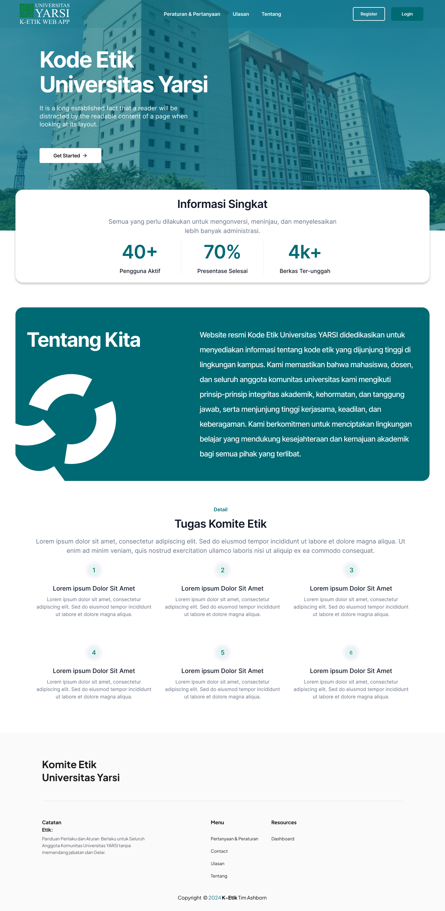

# Komte Etik Universitas YARSI

Pengembangan aplikasi web service dan aplikasi komite etik berbasis website untuk meningkatkan efisiensi dan kepatuhan terhadap standar etika penelitian.

## Tampilan dan Fitur
### Pengusul / Administrator / Reviewer / Ketua
- Halaman Utama
- Peraturan dan Pertanyaan
- Ulasan
- Tentang
- Register
- Login
- Lupa Kata Sandi
- Verifikasi Email
- Ubah Kata Sandi dari Lupa Kata Sandi
- Dashboard
- Notifikasi
- Logout

### Pengusul
- Unggah Berkas Proposal
- Lihat Berkas Proposal
- Filter Berkas Proposal
- Detail Berkas Proposal
- Memperbaharui Berkas Proposal
- Unduh Berkas Proposal

### Administrator
- Lihat Berkas Proposal
- Filter Berkas Proposal
- Detail Berkas Proposal
- Pilih Reviewer
- Pilih Status Pengajuan (Kirim ke Pengusul / Tidak Layak) / (Kirim ke Pengusul / Perbaikan) / (Tandatangan Dokumen)
- Unduh Berkas Proposal
- Unggah Berkas Proposal yang sudah Ditandatangin Manual oleh Ketua
- Manajemen Pengguna (Menambahkan / Memperbaharui)

### Reviewer
- Lihat Berkas Proposal
- Memberikan Status Layak / Tidak Layak pada Berkas Proposal

### Ketua
- Manajemen Penjadwalan Pertemuan (Menambahkan / Memperbaharui / Menghapus)

## Screenshots

## Color Reference

| Color             | Hex                                                                |
| ----------------- | ------------------------------------------------------------------ |
| Primary Color |  #006A74 |

## Tech Stack

**Client:** Vite, React, React Query, Tailwind CSS, Full Calendar, Material UI, Axios, Formik, Yup, MUI-File-Input, Framer-Motion, React-Router, React-Hot-Toast, React-Icons.

**Server:** Node, Express JS, Archiver, bcryptjs, Mongoose, Mongo DB, Multer, Nodemailer, Validator, Sharp, JsonWebToken.

## Authors

- [@rioogp](https://www.github.com/rioogp)
- [@hafidzph](https://www.github.com/hafidzph)

## Demo

Coming Soon

